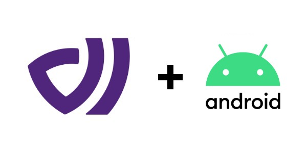

# DataArt Android Client

[](https://jitpack.io/#dataart-ai/dataart-android)


DataArt platform client for Android.

<p>
    
</p>

## Getting Started

Add `jitpack.io` repository to your root `build.gradle` file:

```
allprojects {
    repositories {
        ...
        maven { url 'https://jitpack.io' }
    }
}
```

Now add the following dependency to your app `build.gradle` file:

```
dependencies {
    implementation 'com.datartproject.dataart:0.1.0'
}
```

## Usage

Client instance requires a set of configurations passed by the `DataArt.Config` object. Default values are set for all of them except `apiKey`. You can start sending requests if no exceptions were raised in the initialization process. Keep in mind, no internal singleton pattern is developed by the client itself. It's up to you to manage your running instance.

```kotlin
val dataart = DataArt(appContext, DataArt.Config("your-api-key"))
```

### Emit Action

```kotlin
dataart.emitAction(
    "some-event-key",
    "some-user-key",
    false,
    Date(),
    mapOf()
)
```

### Identify

```kotlin
dataart.identify("some-user-key", mapOf())
```

## Full Example

```kotlin
import android.os.Bundle
import android.view.View
import androidx.appcompat.app.AppCompatActivity
import com.datartproject.dataart.client.DataArt
import java.util.Date

class MainActivity : AppCompatActivity() {
    private lateinit var dataart: DataArt

    override fun onCreate(savedInstanceState: Bundle?) {
        super.onCreate(savedInstanceState)
        setContentView(R.layout.activity_main)

        dataart = DataArt(this, DataArt.Config("your-api-key"))
    }

    fun onButtonClicked(v: View) {
        if (v.id == R.id.btn) {
            dataart.emitAction(
                "some-event-key",
                "some-user-key",
                false,
                Date(),
                mapOf()
            )
        }
    }
}

```

## License

MIT License

Copyright (c) 2021 DataArt

Permission is hereby granted, free of charge, to any person obtaining a copy
of this software and associated documentation files (the "Software"), to deal
in the Software without restriction, including without limitation the rights
to use, copy, modify, merge, publish, distribute, sublicense, and/or sell
copies of the Software, and to permit persons to whom the Software is
furnished to do so, subject to the following conditions:

The above copyright notice and this permission notice shall be included in all
copies or substantial portions of the Software.

THE SOFTWARE IS PROVIDED "AS IS", WITHOUT WARRANTY OF ANY KIND, EXPRESS OR
IMPLIED, INCLUDING BUT NOT LIMITED TO THE WARRANTIES OF MERCHANTABILITY,
FITNESS FOR A PARTICULAR PURPOSE AND NONINFRINGEMENT. IN NO EVENT SHALL THE
AUTHORS OR COPYRIGHT HOLDERS BE LIABLE FOR ANY CLAIM, DAMAGES OR OTHER
LIABILITY, WHETHER IN AN ACTION OF CONTRACT, TORT OR OTHERWISE, ARISING FROM,
OUT OF OR IN CONNECTION WITH THE SOFTWARE OR THE USE OR OTHER DEALINGS IN THE
SOFTWARE.
